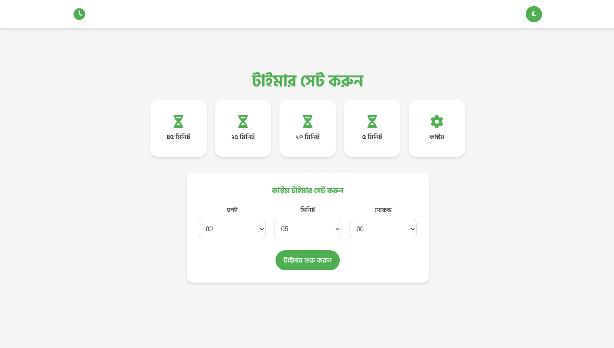

# ⏰ Timer — Your Simple Solution for Time Management

**Timer** is a modern, professional, and user-friendly countdown timer application built entirely in the Bengali language. This app helps you set, track, and manage time — a simple yet powerful tool for boosting productivity.

## ✨ Features

### 🎯 Core Features
- **Preset Timers** — Quick timer options: 45, 25, 10, 5 minutes
- **Custom Timer** — Set hours, minutes, and seconds manually
- **Fullscreen Timer** — Dedicated timer view with SVG progress ring
- **Pause/Resume/Reset** — Complete timer control
- **Dark/Light Mode** — Theme toggle with localStorage preference
- **Scroll Progress Bar** — Visual page scroll indicator
- **Animations** — Smooth AOS library scroll animations
- **Notifications** — SweetAlert2 alerts when timer ends
- **Back to Top** — Scroll button with dynamic visibility

### 🎨 UI/UX
- **Bengali Interface** — Complete app in Bengali language
- **Minimalist Design** — Clean, modern, focused interface
- **SVG Progress Ring** — Visual timer progress indicator
- **Responsive Design** — Mobile, tablet, desktop friendly
- **Current Year** — Auto-updating copyright in footer
- **Custom Scrollbar** — Branded scrolling style

### 📊 Timer Options

| Preset | Time | Icon | Use Case |
|--------|------|------|----------|
| 45 Minutes | 00:45:00 | `fa-hourglass-half` | Work session, Meeting |
| 25 Minutes | 00:25:00 | `fa-hourglass-half` | Pomodoro Technique |
| 10 Minutes | 00:10:00 | `fa-hourglass-half` | Break, Stretching |
| 5 Minutes | 00:05:00 | `fa-hourglass-half` | Quick break |
| Custom | User defined | `fa-cog` | Personalized |

## 🛠 Technologies Used

- **HTML5** — Semantic markup
- **CSS3** — Custom properties, Flexbox, Grid, Keyframe animations
- **JavaScript (ES6+)** — DOM manipulation, localStorage, SVG animations, timer functions
- **AOS Library** — Scroll animations (v2.3.1)
- **Font Awesome 6** — Icon library
- **SweetAlert2** — Modern alerts and notifications
- **Google Fonts** — Hind Siliguri (Bengali font)
- **SVG** — Progress ring circle
